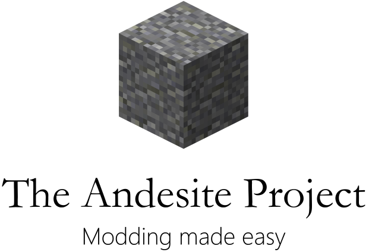

Ever wanted to mod Minecraft, but had no idea where to start? The Andesite Project is a Minecraft modding project aimed at helping out people like you. Using the Andesite Project, you can create blocks and items and alter the behavior of the game with an easy-to-use graphical interface. No coding needed!

Here are some of the goals we aim to reach:

* Create new blocks and items in the game
* Modify the behavoir of existing blocks and items
* Change mob properties (you can make Creepers friendly, for instance)
* Tamperproof packaging: If it has your name on it, then you wrote it

As the project matures, more features will be added, so check back often!

## FAQ

### Can I redistribute this?

Yes, you can redistribute the Andesite Project under the MIT license. You *can not* distribute actual Andesite *mods* without permission from their authors, though, as they may license content separately.

### Can I redistribute mods made by other users using Andesite?

Andesite mods are not considered derivative works as the mods do not contain any code from either Minecraft or Andesite, or any other project whatsoever. This means that they are licensed separately, so you need to get permission from the authors of those mods before you can redistribute them, unless their license grants you that right automatically. This is because Andesite Project uses its own file format for mods, which doesn't contain any form of executable code, rather instructions for how Andesite Mod Loader can change the game. Confused? Think about Microsoft Word, and Word documents. Andesite mods are not derivatives of Andesite Project in the same way Word documents are not derivatives of Microsoft Word.

### When will this project be done?

I have no idea. Maybe it never will. Anyone is welcome to help out, though! The main developer IDE is, at the moment, NetBeans.
